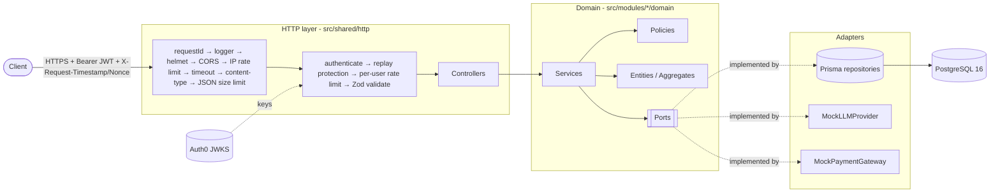

# Secure AI Chat & Subscription Backend

> **Status:** Phase 0 (scaffold) complete. Sections marked _⏳ Phase N_ are filled in as the
> corresponding phase lands; the Requirements Traceability Matrix tracks progress honestly.

## Table of contents

1. [Overview](#1-overview)
2. [Quick start](#2-quick-start)
3. [Auth0 setup](#3-auth0-setup)
4. [How to call the API](#4-how-to-call-the-api)
5. [Architecture decisions](#5-architecture-decisions)
6. [Security model](#6-security-model)
7. [Quota and concurrency design](#7-quota-and-concurrency-design)
8. [Subscription lifecycle](#8-subscription-lifecycle)
9. [Decision Log](#9-decision-log)
10. [Assumptions](#10-assumptions)
11. [Evaluation / Requirements Traceability Matrix](#11-evaluation--requirements-traceability-matrix)
12. [Testing strategy](#12-testing-strategy)
13. [Observability](#13-observability)
14. [Known limitations and production next steps](#14-known-limitations-and-production-next-steps)
15. [Use of AI tools](#15-use-of-ai-tools)

---

## 1. Overview

A production-style REST backend, written in strict TypeScript, that:

- answers user questions through a **mocked LLM** and stores question, answer, token usage and request metadata;
- enforces a **monthly free quota (3 messages)** and then deducts from **subscription bundles** (Basic / Pro / Enterprise) atomically and safely under concurrency;
- manages the **subscription lifecycle** (monthly/yearly billing, auto-renew, cancellation, simulated payment failures, renewal job);
- delegates identity to **Auth0 (OIDC)**, verifies JWTs server-side and adds **timestamp + nonce replay protection** so a bearer token alone is not enough;
- is layered as **Clean Architecture / DDD** with a framework-free domain, enforced by lint rules.



## 2. Quick start

**Prerequisites:** Node.js 22 LTS (`.nvmrc`), Docker with Compose v2.

```bash
# 1. Install dependencies (also generates the Prisma client)
npm ci

# 2. Start PostgreSQL 16: `db` on localhost:5440 (dev) and `db-test` on localhost:5441 (tests)
docker compose up -d --wait

# 3. Configure the environment, then fill in your Auth0 tenant values (see §3)
cp .env.example .env

# 4. Apply migrations to the dev database
npm run db:migrate

# 5. Run the API (http://localhost:3000)
npm run dev
curl -s localhost:3000/health   # {"status":"ok","checks":{"database":"ok"}}

# 6. Quality gate: typecheck + lint + format check + unit & integration tests
npm run check
```

| Script                                   | Purpose                                              |
| ---------------------------------------- | ---------------------------------------------------- |
| `npm run dev`                            | Run with `tsx watch`, loading `.env`                 |
| `npm run build` / `npm start`            | Compile to `dist/` and run the compiled server       |
| `npm run db:migrate`                     | Create/apply migrations against `DATABASE_URL` (dev) |
| `npm run db:migrate:deploy`              | Apply committed migrations only (CI / production)    |
| `npm test`                               | All tests (integration tests need `db-test` running) |
| `npm run test:unit` / `test:integration` | One suite only                                       |
| `npm run test:coverage`                  | Tests with V8 coverage (`coverage/`)                 |
| `npm run check`                          | Everything CI runs, except build and audit           |
| `db:seed`                                | _⏳ Phase 4_ — demo data                             |

Ports 5440/5441 are used instead of 5432 so the stack does not clash with a locally installed PostgreSQL.

## 3. Auth0 setup

_⏳ Phase 1/5._ Tenant, API audience (`https://ggi-api`), Username-Password and Google connections, the roles Action
(namespaced claim `https://ggi-api/roles`), and how to obtain a test token.

## 4. How to call the API

_⏳ Phase 1/5._ Example `curl` with `Authorization`, `X-Request-Timestamp` and `X-Request-Nonce`, plus `scripts/signed-request.ts`.

## 5. Architecture decisions

### Folder layout

```
src/
  modules/<module>/
    domain/            entities, services, policies, ports, errors — pure TypeScript
    repositories/      Prisma adapters implementing domain ports
    infrastructure/    other adapters (mock LLM, mock payment gateway, cron jobs)
    controllers/       Express routes, Zod schemas, DTO ↔ domain mapping
  shared/
    auth/ http/ config/ logging/ db/ errors/
  container.ts         composition root (manual DI)
  server.ts            process entrypoint: listen, cron, graceful shutdown
```

### Dependency rule

Dependencies point inwards: `controllers → domain ← repositories/infrastructure`. The domain never imports Express,
Prisma, pino, Zod, jose, node-cron or any outer layer. This is **enforced by ESLint** (`no-restricted-imports`
scoped to `src/modules/*/domain/**` in [`eslint.config.js`](eslint.config.js)), so a violation fails `npm run check` and CI.

### Composition root and testability

[`src/container.ts`](src/container.ts) is the only place that instantiates concrete adapters.
[`createApp(deps)`](src/shared/http/app.ts) receives everything it needs (config, logger, DB health check; later the
JWKS, clock, LLM and payment gateway), so tests inject a local JWKS, fake clock and deterministic gateways instead of
switching behaviour on `NODE_ENV`.

### Configuration

[`src/shared/config/env.ts`](src/shared/config/env.ts) validates every variable with Zod at boot and exits on the first
invalid value. Errors name the variable but never echo its value. Notable hardening: `AUTH_ISSUER`/`AUTH_JWKS_URI` must
be `https`, `CORS_ORIGINS` rejects wildcards and non-origin URLs, and `TRUST_PROXY=true` is refused (it would let
clients spoof `X-Forwarded-For` and evade per-IP rate limits — use a hop count instead).

### Database

PostgreSQL 16 via Prisma migrations ([`prisma/schema.prisma`](prisma/schema.prisma)). All timestamps are `timestamptz`,
money is integer cents, and the init migration adds **CHECK constraints** Prisma cannot express (non-negative counters,
`usedMessages <= maxMessages`, `endDate > startDate`, inactive ⇔ reason present, `quotaSource = SUBSCRIPTION` ⇔
`subscriptionId` present) as a last line of defence for quota and money invariants.

### Why this stack

_⏳ Phase 5 (summarised in D-01, D-05, D-10)._ Express 5 (explicit middleware order, native async error propagation),
Prisma (typed queries + migrations, `$queryRaw` tagged templates for row locks), Zod (strict schemas shared by env and
DTO validation), `jose` (standards-compliant JOSE/JWKS with no native deps).

## 6. Security model

_⏳ Phase 1–5._ Threat → Mitigation → Where in code → Test that proves it.

## 7. Quota and concurrency design

_⏳ Phase 2._ Reserve → generate → finalize sequence diagram, locking strategy, refund path.

## 8. Subscription lifecycle

_⏳ Phase 3._ State diagram and renewal job with `FOR UPDATE SKIP LOCKED`.

## 9. Decision Log

| ID   | Decision                                                                | Alternatives considered                  | Rationale                                                                                                                                                                              |
| ---- | ----------------------------------------------------------------------- | ---------------------------------------- | -------------------------------------------------------------------------------------------------------------------------------------------------------------------------------------- |
| D-01 | Express 5                                                               | Fastify, NestJS                          | Familiar, explicit middleware ordering (security order matters), native async error propagation. NestJS's decorators/DI would blur the DDD boundaries the task asks to demonstrate.    |
| D-02 | Reserve → generate → finalize with compensation                         | One transaction around the LLM call      | Row locks are never held during LLM latency; a failed generation refunds exactly the reserved unit. _Details in §7 (Phase 2)._                                                         |
| D-03 | Period-keyed free-usage rows (`userId`, `YYYY-MM`)                      | Monthly reset cron                       | Reset is automatic and exact at 00:00 UTC on the 1st; no job to miss, no race at midnight, history preserved.                                                                          |
| D-04 | Timestamp + nonce bound to `sub` as the extra token mechanism           | DPoP, mTLS, HMAC request signing         | DPoP needs client key management; mTLS is infra-heavy. Nonce + timestamp blocks replay of a captured token+request with no client crypto. _Phase 1._                                   |
| D-05 | Prisma, with raw `FOR UPDATE` only where locking matters                | Raw SQL everywhere, TypeORM, Knex        | Typed queries and migrations everywhere; `$queryRaw` tagged templates (parameterised) only for row locks. `$queryRawUnsafe` is banned by lint.                                         |
| D-06 | `FOR UPDATE SKIP LOCKED` renewal batches                                | Advisory locks, single-instance cron     | Multiple instances can run the job concurrently without double-charging. _Phase 3._                                                                                                    |
| D-07 | Dual-layer authorization (controller `requireRole` + domain policy)     | Controller-only checks                   | Defense in depth: a forgotten controller check cannot leak data. _Phase 1–3._                                                                                                          |
| D-08 | 404 instead of 403 for other users' resources                           | 403                                      | Does not reveal that a resource ID exists.                                                                                                                                             |
| D-09 | `GET /health` is the single unauthenticated endpoint                    | Authenticated health, no health endpoint | Load balancers/orchestrators cannot present JWTs. It returns only up/down (no versions or internals), sends `Cache-Control: no-store`, is IP rate-limited; `/metrics` is admin-only.   |
| D-10 | No LangChain / agent framework                                          | LangChain, Vercel AI SDK                 | The LLM is mocked by spec; an `LLMProvider` port keeps a real provider pluggable without a heavy dependency.                                                                           |
| D-11 | Integer cents, UTC everywhere (`timestamptz`)                           | Decimal/float money, local time          | No floating-point rounding; calendar-month boundaries are unambiguous.                                                                                                                 |
| D-12 | DB CHECK constraints for quota/money invariants                         | Application checks only                  | A bug in application code cannot drive a counter negative or past its limit.                                                                                                           |
| D-13 | Pinned stable majors: TypeScript 5.9, Prisma 6.19, ESLint 9, Vitest 4.1 | Latest tags (TS 7, Prisma 8 RC)          | typescript-eslint supports TS < 6.1; Prisma 8 is a release candidate. A `deepmerge-ts` override clears a dev-tool advisory in Prisma's config loader (`npm audit`: 0 vulnerabilities). |

## 10. Assumptions

| ID   | Assumption                                                                                                                                 |
| ---- | ------------------------------------------------------------------------------------------------------------------------------------------ |
| A-01 | "Bundle with the latest remaining quota" = the **newest active bundle that still has remaining quota** (`startDate DESC, createdAt DESC`). |
| A-02 | Free quota is always consumed before paid bundles.                                                                                         |
| A-03 | "Calendar month" is evaluated in **UTC**.                                                                                                  |
| A-04 | Bundle quota is per billing cycle and resets on renewal; yearly bundles receive `maxMessages × 12`.                                        |
| A-05 | A failed initial payment still creates an `INACTIVE` (`PAYMENT_FAILED`) subscription record so payment history is preserved.               |
| A-06 | "Authentication endpoints" = the backend's token/session endpoints (`/auth/*`), because login itself happens at Auth0.                     |
| A-07 | Roles come from the token claim (source of truth) and are mirrored to the `User` row.                                                      |
| A-08 | Cancelled subscriptions remain usable until `endDate`.                                                                                     |
| A-09 | Tier prices are illustrative.                                                                                                              |
| A-10 | `User.email` is optional: Auth0 access tokens do not carry email unless an Action adds it.                                                 |

## 11. Evaluation / Requirements Traceability Matrix

Legend: ✅ done and tested · ⚠️ partial · ⏳ planned (phase).

| Requirement (assessment PDF)                                                         | Implementation                                                           | Tests                                                                                        | Status                                              |
| ------------------------------------------------------------------------------------ | ------------------------------------------------------------------------ | -------------------------------------------------------------------------------------------- | --------------------------------------------------- |
| TypeScript strict mode                                                               | [`tsconfig.json`](tsconfig.json) (`strict` + extra strict flags)         | `npm run typecheck` in CI                                                                    | ✅                                                  |
| Relational DB with migrations                                                        | [`prisma/schema.prisma`](prisma/schema.prisma), `prisma/migrations/`     | integration suite migrates `db-test` via `prisma migrate deploy`                             | ✅                                                  |
| Environment-based configuration                                                      | [`src/shared/config/env.ts`](src/shared/config/env.ts), `.env.example`   | [`tests/unit/shared/config/env.test.ts`](tests/unit/shared/config/env.test.ts)               | ✅                                                  |
| ESLint + Prettier configured and enforced                                            | [`eslint.config.js`](eslint.config.js), `.prettierrc.json`, CI           | `npm run lint`, `npm run format:check` in CI                                                 | ✅                                                  |
| Clean Architecture; business logic framework-independent                             | `src/modules/*/domain`, lint boundary rule                               | lint rule fails the build on violation                                                       | ⚠️ rule in place; modules ⏳ Phase 2–3              |
| Centralized error handling, structured JSON                                          | [`src/shared/http/errorHandler.ts`](src/shared/http/errorHandler.ts)     | [`tests/unit/shared/http/errorHandler.test.ts`](tests/unit/shared/http/errorHandler.test.ts) | ✅                                                  |
| Structured logging (request ID, user ID, response time)                              | [`src/shared/logging/logger.ts`](src/shared/logging/logger.ts), `app.ts` | —                                                                                            | ⚠️ request ID + response time; user ID ⏳ Phase 1/4 |
| Health check endpoint                                                                | [`src/shared/http/health.routes.ts`](src/shared/http/health.routes.ts)   | [`tests/integration/health.test.ts`](tests/integration/health.test.ts)                       | ✅                                                  |
| Basic metrics endpoint                                                               | —                                                                        | —                                                                                            | ⏳ Phase 4                                          |
| External OIDC provider; email/password + one OAuth provider                          | —                                                                        | —                                                                                            | ⏳ Phase 1                                          |
| Server-side token verification (issuer, audience, expiry)                            | —                                                                        | —                                                                                            | ⏳ Phase 1                                          |
| Token alone insufficient (additional mechanism)                                      | —                                                                        | —                                                                                            | ⏳ Phase 1                                          |
| RBAC (user / admin), controller + domain policy                                      | —                                                                        | —                                                                                            | ⏳ Phase 1–4                                        |
| Secure headers, restricted CORS, size limits, content-type, timeout                  | —                                                                        | —                                                                                            | ⏳ Phase 1                                          |
| Rate limiting per IP / per user, per endpoint group                                  | —                                                                        | —                                                                                            | ⏳ Phase 1                                          |
| Schema validation, unknown fields rejected, XSS/injection, mass assignment           | —                                                                        | —                                                                                            | ⏳ Phase 1–3                                        |
| Chat: mocked LLM with latency, persistence of Q/A/tokens/metadata                    | —                                                                        | —                                                                                            | ⏳ Phase 2                                          |
| Quota: 3 free/month, auto reset, bundles, typed errors, atomic & concurrent-safe     | Schema: `MonthlyFreeUsage`, CHECK constraints                            | —                                                                                            | ⏳ Phase 2                                          |
| Subscriptions: tiers, cycles, auto-renew, billing simulation, cancellation           | Schema: `Subscription`, `PaymentAttempt`                                 | —                                                                                            | ⏳ Phase 3                                          |
| Unit tests: domain, quota, lifecycle                                                 | —                                                                        | —                                                                                            | ⏳ Phase 2–3                                        |
| Integration tests: auth, rate limiting, security middleware; IdP mocked not bypassed | —                                                                        | —                                                                                            | ⏳ Phase 1                                          |
| README: architecture, security model, setup                                          | this file                                                                | —                                                                                            | ⚠️ in progress                                      |

## 12. Testing strategy

- **Unit** (`tests/unit`, no database): pure domain logic and isolated middleware, run with fakes.
- **Integration** (`tests/integration`): real Express app via Supertest against a real PostgreSQL (`db-test`), migrated
  by a Vitest global setup. Files run serially because they share one database.
- **Identity provider** _(⏳ Phase 1)_: tests generate an RS256 key pair, publish it as a local JWKS injected into
  `createApp`, and mint tokens; the production verification code runs unchanged. There is no test-only auth bypass.
- Tests build their configuration through the real `loadConfig`, so env validation is exercised too.

## 13. Observability

Logs are single-line JSON (pino). Every request gets a UUID request ID and is logged once on completion:

```json
{
  "level": "info",
  "time": "2026-10-02T17:00:00.000Z",
  "service": "ggi-api",
  "req": { "id": "6c0f…", "method": "GET", "path": "/health" },
  "res": { "statusCode": 200 },
  "responseTimeMs": 3,
  "msg": "request completed"
}
```

Headers and bodies are never logged; `authorization`, `cookie` and `x-request-signature` are additionally redacted.
Query strings are stripped from logged paths. User ID enrichment and the `/metrics` endpoint arrive in Phase 4.

## 14. Known limitations and production next steps

- _Filled in as phases land._ Planned: Redis-backed rate limits and nonce store, real payment provider + webhooks,
  outbox/event bus, OpenTelemetry tracing, secret manager, JWKS key-rotation monitoring.
- **Prisma auto-loads `.env`:** importing the generated Prisma client reads `.env` from the project root into
  `process.env` (without overriding variables that are already set). Production deployments should not ship a `.env`
  file; configuration comes from the real environment and is validated by `loadConfig` either way.
- **Tooling note:** npm 10's dependency resolver crashes (`Cannot read properties of null (reading 'edgesOut')`) when
  re-resolving Vitest 4's peer set. `npm ci` from the committed lockfile works on npm 10; to add or upgrade
  dependencies use `npx npm@11 install …`.

## 15. Use of AI tools

_⏳ Phase 5._
