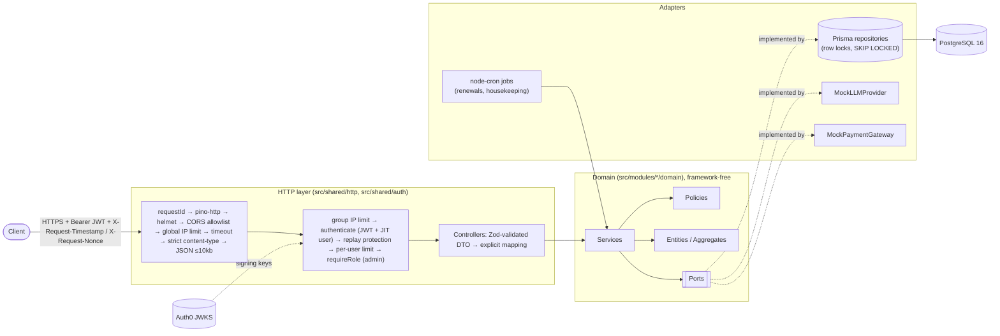
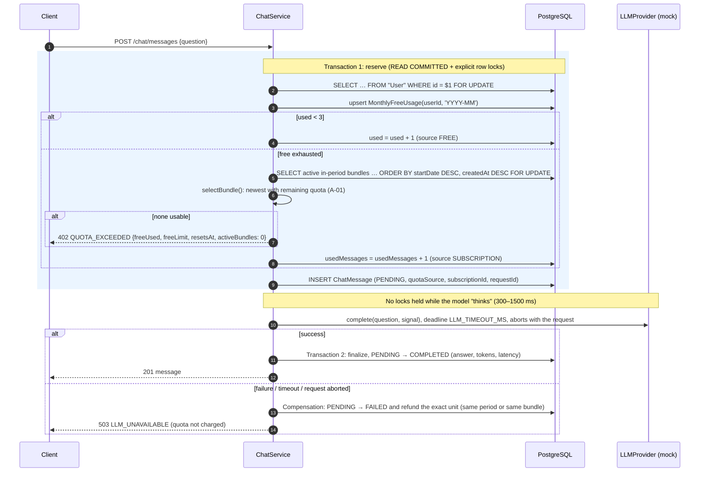
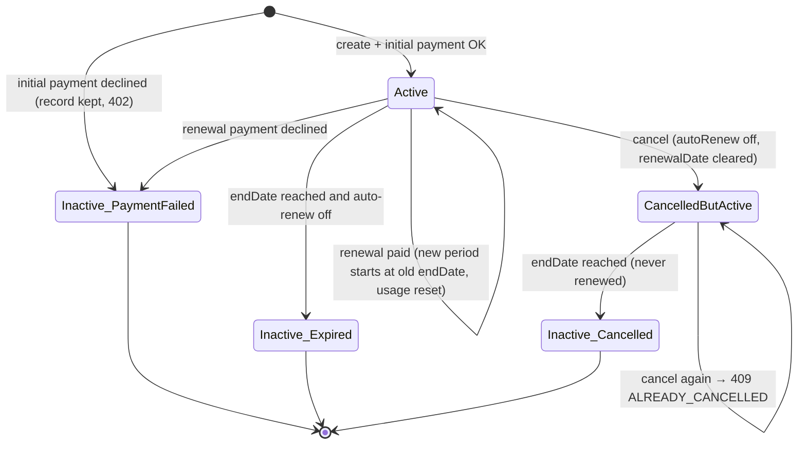

# Secure AI Chat & Subscription Backend

This is my submission for the GGI backend assessment: a production-style, security-first REST backend in strict
TypeScript. It has an AI chat module with an atomic, concurrency-safe quota system, and a subscription-bundle module
with a simulated billing lifecycle. Identity comes from Auth0 (OIDC), and I enforce the Clean Architecture / DDD
layering with lint rules rather than convention alone.

**At a glance:** 200 automated tests (116 unit + 84 integration against real PostgreSQL), ~92% line coverage,
`npm run check` and CI green, and 0 known vulnerabilities in dependencies (`npm audit`).

## Table of contents

1. [Overview](#1-overview)
2. [Quick start](#2-quick-start)
3. [Auth0 setup](#3-auth0-setup)
4. [How to call the API](#4-how-to-call-the-api)
5. [Architecture decisions](#5-architecture-decisions)
6. [Security model](#6-security-model)
7. [Quota and concurrency design](#7-quota-and-concurrency-design)
8. [Subscription lifecycle](#8-subscription-lifecycle)
9. [Decision Log](#9-decision-log)
10. [Assumptions](#10-assumptions)
11. [Evaluation / Requirements Traceability Matrix](#11-evaluation--requirements-traceability-matrix)
12. [Testing strategy](#12-testing-strategy)
13. [Observability](#13-observability)
14. [Known limitations and production next steps](#14-known-limitations-and-production-next-steps)
15. [Use of AI tools](#15-use-of-ai-tools)

---

## 1. Overview

- **Chat:** users ask questions and receive a **mocked OpenAI completion** (simulated latency). Question, answer,
  token usage and request metadata are stored.
- **Quota:** each user gets **3 free messages per UTC calendar month**. After that, messages are deducted from the
  **newest subscription bundle that still has quota**. Deduction is atomic and safe under parallel requests, and a
  failed generation is refunded.
- **Subscriptions:** Basic / Pro / Enterprise bundles, billed monthly or yearly, with auto-renew. A cron renewal job
  simulates payments (random failures), and cancellation takes effect at the end of the cycle.
- **Security:** Auth0 JWTs are verified server-side. **Timestamp + nonce replay protection** means a token alone is
  not enough. RBAC is enforced at both the controller and the domain-policy level, alongside rate limits, strict
  validation and hardened HTTP middleware.



## 2. Quick start

**Prerequisites:** Node.js 22 LTS (`.nvmrc`) and Docker with Compose v2.

```bash
# 1. Install dependencies (also generates the Prisma client)
npm ci

# 2. Start PostgreSQL 16: `db` on localhost:5440 (dev) and `db-test` on localhost:5441 (tests)
docker compose up -d --wait

# 3. Configure the environment, then fill in your Auth0 values (see §3)
cp .env.example .env

# 4. Create the schema and load demo data
npm run db:migrate
npm run db:seed

# 5. Run the API on http://localhost:3000
npm run dev
curl -s localhost:3000/health          # {"status":"ok","checks":{"database":"ok"}}

# 6. Full quality gate: typecheck + lint + format check + unit & integration tests
npm run check
```

| Script                                           | Purpose                                                          |
| ------------------------------------------------ | ---------------------------------------------------------------- |
| `npm run dev`                                    | Run with `tsx watch`, loading `.env`                             |
| `npm run build` / `npm start`                    | Compile to `dist/`, then run the compiled server                 |
| `npm run db:migrate` / `db:migrate:deploy`       | Create and apply migrations (dev) / apply committed ones only    |
| `npm run db:seed`                                | Idempotent demo data (`seed\|alice`, `seed\|bob`, `seed\|admin`) |
| `npm test`                                       | All tests (integration tests need `db-test` running)             |
| `npm run test:unit` / `npm run test:integration` | One suite                                                        |
| `npm run test:coverage`                          | Tests with V8 coverage (`coverage/`)                             |
| `npm run check`                                  | Everything CI runs except build and audit                        |

The databases use ports 5440/5441 instead of 5432, so they don't clash with a locally installed PostgreSQL.

## 3. Auth0 setup

The backend does no authentication itself. It only verifies Auth0-issued access tokens.

1. **Tenant:** create one (e.g. `your-tenant.us.auth0.com`). Then
   `AUTH_ISSUER=https://your-tenant.us.auth0.com/` (trailing slash included) and
   `AUTH_JWKS_URI=https://your-tenant.us.auth0.com/.well-known/jwks.json`.
2. **API:** Applications → APIs → _Create API_. Identifier `https://ggi-api` (this becomes `AUTH_AUDIENCE`), signing
   algorithm **RS256**. Auth0 issues `aud` as an array (`[api, userinfo]`); the verifier accepts any matching entry.
3. **Connections:**
   - _Database → Username-Password-Authentication_ (email/password), enabled for your application.
   - _Social → Google_ (`google-oauth2`), enabled for the same application. This is the OAuth provider.
4. **Application:** a _Single Page Application_ (Authorization Code + PKCE) for real users. For quick manual testing,
   a _Regular Web Application_ with the **Password** grant enabled (Advanced Settings → Grant Types), with tenant
   _Default Directory_ set to `Username-Password-Authentication`.
5. **Roles:** User Management → Roles → create `admin`, then assign it to your admin user.
6. **Action** (Actions → Library → Build custom → trigger _Login / Post Login_), deployed and added to the Login flow:

   ```js
   exports.onExecutePostLogin = async (event, api) => {
     const namespace = 'https://ggi-api';
     // Roles are the source of truth for RBAC (A-07). Namespaced to avoid clashing with standard claims.
     api.accessToken.setCustomClaim(`${namespace}/roles`, event.authorization?.roles ?? []);
     if (event.user.email) {
       api.accessToken.setCustomClaim(`${namespace}/email`, event.user.email);
     }
   };
   ```

   Set `AUTH_ROLES_CLAIM=https://ggi-api/roles` and `AUTH_EMAIL_CLAIM=https://ggi-api/email`.

7. **Getting a test token:**
   - _Fastest (machine-to-machine):_ APIs → `ggi-api` → _Test_ tab → copy the access token. It has no roles, so it
     acts as a `USER` whose subject is `<client-id>@clients`.
   - _Email/password user (testing only):_

     ```bash
     curl -s https://your-tenant.us.auth0.com/oauth/token -H 'content-type: application/json' -d '{
       "grant_type": "password", "username": "alice@example.com", "password": "…",
       "audience": "https://ggi-api", "scope": "openid email",
       "client_id": "…", "client_secret": "…" }' | jq -r .access_token
     ```

   - _Google:_ sign in through Universal Login with the SPA (or
     `https://your-tenant.us.auth0.com/authorize?response_type=code&connection=google-oauth2&audience=https://ggi-api&client_id=…&redirect_uri=…&code_challenge=…&code_challenge_method=S256`)
     and exchange the code for an access token.

## 4. How to call the API

Every endpoint except `GET /health` needs three headers:

| Header                | Value                                                            |
| --------------------- | ---------------------------------------------------------------- |
| `Authorization`       | `Bearer <Auth0 access token>`. Query-string tokens are rejected. |
| `X-Request-Timestamp` | Current time in **unix milliseconds** (accepted within ±300 s)   |
| `X-Request-Nonce`     | A fresh **UUID v4**, **single use** per token subject            |

```bash
TOKEN=eyJ...   # from §3
curl -sS -X POST http://localhost:3000/chat/messages \
  -H "Authorization: Bearer $TOKEN" \
  -H "X-Request-Timestamp: $(date +%s%3N)" \
  -H "X-Request-Nonce: $(cat /proc/sys/kernel/random/uuid)" \
  -H 'Content-Type: application/json' \
  --data '{"question":"What is Domain-Driven Design?"}'
```

[`scripts/signed-request.ts`](scripts/signed-request.ts) generates the headers for you:

```bash
TOKEN=eyJ... npx tsx scripts/signed-request.ts GET /auth/me
TOKEN=eyJ... npx tsx scripts/signed-request.ts POST /subscriptions '{"tier":"PRO","billingCycle":"MONTHLY","autoRenew":true}'
TOKEN=eyJ... npx tsx scripts/signed-request.ts --curl GET /chat/usage     # print a curl command instead
```

Replaying the exact same request returns `401 REPLAY_DETECTED`. A timestamp older than 5 minutes returns
`401 REQUEST_EXPIRED`.

### Endpoints

| Method | Path                            | Role          | Purpose                                                                  |
| ------ | ------------------------------- | ------------- | ------------------------------------------------------------------------ |
| GET    | `/health`                       | public (D-09) | `{status, checks.database}` only                                         |
| GET    | `/auth/me`                      | user          | Provisioned profile and roles                                            |
| POST   | `/auth/session/verify`          | user          | Token + replay-check diagnostics                                         |
| POST   | `/chat/messages`                | user          | `{question}` → mocked answer (quota enforced), `201`                     |
| GET    | `/chat/messages?limit&offset`   | user          | Own history, newest first (`limit` ≤ 50)                                 |
| GET    | `/chat/messages/:id`            | user          | Own message (others → 404)                                               |
| GET    | `/chat/usage`                   | user          | Free used/remaining, reset instant, per-bundle remaining                 |
| POST   | `/subscriptions`                | user          | `{tier, billingCycle, autoRenew}` only, `201` (or `402 PAYMENT_FAILED`)  |
| GET    | `/subscriptions`                | user          | Own subscriptions                                                        |
| GET    | `/subscriptions/:id`            | user          | Own subscription                                                         |
| PATCH  | `/subscriptions/:id/auto-renew` | user          | `{autoRenew}` only                                                       |
| POST   | `/subscriptions/:id/cancel`     | user          | Cancel at end of cycle (no body)                                         |
| GET    | `/metrics`                      | admin         | Usage, subscriptions, payments and renewals for the current UTC month    |
| GET    | `/admin/users/:id/chats`        | admin         | Any user's chat history                                                  |
| GET    | `/admin/subscriptions`          | admin         | All subscriptions; filters `status`, `tier`, `userId`, `limit`, `offset` |
| POST   | `/admin/billing/run-renewals`   | admin         | Run the renewal job now                                                  |

Every error uses one envelope:

```json
{
  "error": {
    "code": "QUOTA_EXCEEDED",
    "message": "Monthly free quota is used up and no subscription bundle has remaining quota",
    "details": {
      "freeUsed": 3,
      "freeLimit": 3,
      "resetsAt": "2026-11-01T00:00:00.000Z",
      "activeBundles": 0,
      "exhaustedBundles": 1
    },
    "requestId": "6c0f2b7e-…"
  }
}
```

Error codes ([`errorCodes.ts`](src/shared/errors/errorCodes.ts)), mapped to HTTP status only in
[`errorHandler.ts`](src/shared/http/errorHandler.ts):

| Status | Codes                                                                    |
| ------ | ------------------------------------------------------------------------ |
| 401    | `UNAUTHENTICATED`, `INVALID_TOKEN`, `REQUEST_EXPIRED`, `REPLAY_DETECTED` |
| 403    | `FORBIDDEN`                                                              |
| 404    | `NOT_FOUND`                                                              |
| 400    | `VALIDATION_ERROR`, `MALFORMED_JSON`                                     |
| 413    | `PAYLOAD_TOO_LARGE`                                                      |
| 415    | `UNSUPPORTED_MEDIA_TYPE`                                                 |
| 402    | `QUOTA_EXCEEDED`, `PAYMENT_FAILED`                                       |
| 409    | `ALREADY_CANCELLED`, `INVALID_STATE_TRANSITION`                          |
| 429    | `RATE_LIMITED`                                                           |
| 503    | `REQUEST_TIMEOUT`, `LLM_UNAVAILABLE` (D-15)                              |
| 500    | `INTERNAL_ERROR`                                                         |

### Live demo (real Auth0 token)

I recorded this on 2026-10-02 against `npm run dev` and the dev database, using a real access token for my Auth0
test user (Username-Password connection, `admin` role, password grant; see §3). The commands are exactly as I ran
them; only the token is redacted (it never appears in any response). IDs and timestamps are the real values from
that run.

```bash
# Obtain a token (§3), then:
export TOKEN=<redacted>
```

**1. Who am I?** The user is provisioned just-in-time from the token. `role: ADMIN` comes from the `https://ggi-api/roles` claim set by the Auth0 Action.

```bash
TOKEN=<redacted> npx tsx scripts/signed-request.ts GET /auth/me
```

```text
HTTP 200
{
  "id": "3d2e0ea3-4c2d-4df8-941d-d1e84eb8d422",
  "sub": "auth0|6abfd4fc65287fdc6865f4ea",
  "email": null,
  "role": "ADMIN",
  "roles": [
    "admin"
  ],
  "createdAt": "2026-10-02T18:41:28.146Z"
}
```

**2. Free message 1 of 3**

```bash
TOKEN=<redacted> npx tsx scripts/signed-request.ts POST /chat/messages '{"question":"Live demo question 1: what is Domain-Driven Design?"}'
```

```text
HTTP 201
{
  "id": "fac2fe20-5506-4659-86d0-f4be69f47ee4",
  "userId": "3d2e0ea3-4c2d-4df8-941d-d1e84eb8d422",
  "question": "Live demo question 1: what is Domain-Driven Design?",
  "answer": "Short version first, then details. You asked: \"Live demo question 1: what is Domain-Driven Design?\". This is a simulated response from a mocked OpenAI model; in production this text would come from the real provider. (ref 5f6b23a4)",
  "status": "COMPLETED",
  "quotaSource": "FREE",
  "subscriptionId": null,
  "model": "gpt-4o-mini (mock)",
  "usage": {
    "promptTokens": 13,
    "completionTokens": 58,
    "totalTokens": 71
  },
  "latencyMs": 1355,
  "requestId": "8d557dcc-6db4-4bc6-8157-2b60f7eb64d1",
  "createdAt": "2026-10-02T18:41:28.870Z",
  "completedAt": "2026-10-02T18:41:30.237Z"
}
```

**3. Free message 2 of 3**

```bash
TOKEN=<redacted> npx tsx scripts/signed-request.ts POST /chat/messages '{"question":"Live demo question 2: what is Domain-Driven Design?"}'
```

```text
HTTP 201
{
  "id": "05b6a6a9-3050-449b-9bc8-db19fe89655e",
  "userId": "3d2e0ea3-4c2d-4df8-941d-d1e84eb8d422",
  "question": "Live demo question 2: what is Domain-Driven Design?",
  "answer": "Short version first, then details. You asked: \"Live demo question 2: what is Domain-Driven Design?\". This is a simulated response from a mocked OpenAI model; in production this text would come from the real provider. (ref 6f3a0306)",
  "status": "COMPLETED",
  "quotaSource": "FREE",
  "subscriptionId": null,
  "model": "gpt-4o-mini (mock)",
  "usage": {
    "promptTokens": 13,
    "completionTokens": 58,
    "totalTokens": 71
  },
  "latencyMs": 1144,
  "requestId": "4903cca5-e0a6-437f-b92f-00a7ce1390d8",
  "createdAt": "2026-10-02T18:41:31.082Z",
  "completedAt": "2026-10-02T18:41:32.235Z"
}
```

**4. Free message 3 of 3**

```bash
TOKEN=<redacted> npx tsx scripts/signed-request.ts POST /chat/messages '{"question":"Live demo question 3: what is Domain-Driven Design?"}'
```

```text
HTTP 201
{
  "id": "b26e918f-ae79-4818-b42b-e37b71fe9311",
  "userId": "3d2e0ea3-4c2d-4df8-941d-d1e84eb8d422",
  "question": "Live demo question 3: what is Domain-Driven Design?",
  "answer": "Let me break that down. You asked: \"Live demo question 3: what is Domain-Driven Design?\". This is a simulated response from a mocked OpenAI model; in production this text would come from the real provider. (ref 0a67b64d)",
  "status": "COMPLETED",
  "quotaSource": "FREE",
  "subscriptionId": null,
  "model": "gpt-4o-mini (mock)",
  "usage": {
    "promptTokens": 13,
    "completionTokens": 55,
    "totalTokens": 68
  },
  "latencyMs": 1321,
  "requestId": "6c4dae9b-12e2-4331-92e0-1c25eb11f5c8",
  "createdAt": "2026-10-02T18:41:33.224Z",
  "completedAt": "2026-10-02T18:41:34.558Z"
}
```

**5. The 4th message has no quota left → `402 QUOTA_EXCEEDED`** (typed details, including the UTC reset instant)

```bash
TOKEN=<redacted> npx tsx scripts/signed-request.ts POST /chat/messages '{"question":"Live demo question 4: what is Domain-Driven Design?"}'
```

```text
HTTP 402
{
  "error": {
    "code": "QUOTA_EXCEEDED",
    "message": "Monthly free quota is used up and no subscription bundle has remaining quota",
    "details": {
      "freeUsed": 3,
      "freeLimit": 3,
      "resetsAt": "2026-11-01T00:00:00.000Z",
      "activeBundles": 0,
      "exhaustedBundles": 0
    },
    "requestId": "e1570abe-4b03-40d7-b51d-0d31f5e0a724"
  }
}
```

**6. Buy a BASIC bundle.** Price, quota and dates are derived server-side from the tier catalogue (the mock gateway charged successfully).

```bash
TOKEN=<redacted> npx tsx scripts/signed-request.ts POST /subscriptions '{"tier":"BASIC","billingCycle":"MONTHLY","autoRenew":true}'
```

```text
HTTP 201
{
  "id": "e60b9b75-212f-486d-8335-9c9b58b07fc8",
  "userId": "3d2e0ea3-4c2d-4df8-941d-d1e84eb8d422",
  "tier": "BASIC",
  "billingCycle": "MONTHLY",
  "maxMessages": 10,
  "usedMessages": 0,
  "remainingMessages": 10,
  "priceCents": 999,
  "currency": "USD",
  "startDate": "2026-10-02T18:41:36.183Z",
  "endDate": "2026-11-02T18:41:36.183Z",
  "renewalDate": "2026-11-02T18:41:36.183Z",
  "autoRenew": true,
  "status": "ACTIVE",
  "inactiveReason": null,
  "cancelledAt": null,
  "createdAt": "2026-10-02T18:41:36.183Z",
  "updatedAt": "2026-10-02T18:41:36.183Z"
}
```

**7. The next message succeeds, charged to the new bundle** (`quotaSource: SUBSCRIPTION`)

```bash
TOKEN=<redacted> npx tsx scripts/signed-request.ts POST /chat/messages '{"question":"Live demo question 5: now served by my BASIC bundle?"}'
```

```text
HTTP 201
{
  "id": "c3ddc124-959f-4248-a378-c5964d552a01",
  "userId": "3d2e0ea3-4c2d-4df8-941d-d1e84eb8d422",
  "question": "Live demo question 5: now served by my BASIC bundle?",
  "answer": "Let me break that down. You asked: \"Live demo question 5: now served by my BASIC bundle?\". This is a simulated response from a mocked OpenAI model; in production this text would come from the real provider. (ref 46ba45bc)",
  "status": "COMPLETED",
  "quotaSource": "SUBSCRIPTION",
  "subscriptionId": "e60b9b75-212f-486d-8335-9c9b58b07fc8",
  "model": "gpt-4o-mini (mock)",
  "usage": {
    "promptTokens": 13,
    "completionTokens": 56,
    "totalTokens": 69
  },
  "latencyMs": 460,
  "requestId": "bc401221-a20f-4371-96c9-33e971895598",
  "createdAt": "2026-10-02T18:41:36.948Z",
  "completedAt": "2026-10-02T18:41:37.434Z"
}
```

**8. Usage summary**

```bash
TOKEN=<redacted> npx tsx scripts/signed-request.ts GET /chat/usage
```

```text
HTTP 200
{
  "period": "2026-10",
  "free": {
    "limit": 3,
    "used": 3,
    "remaining": 0,
    "resetsAt": "2026-11-01T00:00:00.000Z"
  },
  "bundles": [
    {
      "subscriptionId": "e60b9b75-212f-486d-8335-9c9b58b07fc8",
      "tier": "BASIC",
      "maxMessages": 10,
      "usedMessages": 1,
      "remaining": 9,
      "endDate": "2026-11-02T18:41:36.183Z"
    }
  ],
  "totalRemaining": 9
}
```

**Bonus: the token alone is not enough.** The same valid token without the timestamp/nonce headers is rejected:

```bash
curl -s http://localhost:3000/auth/me -H "Authorization: Bearer <redacted>"
```

```text
HTTP 401
{"error":{"code":"UNAUTHENTICATED","message":"X-Request-Timestamp and X-Request-Nonce headers are required","details":{},"requestId":"cb1ff469-413f-4069-9b7c-2f765acfd32f"}}
```

**Server log for steps 5–7** (`npm run dev` pretty-prints; production logs the same fields as JSON). Each line
carries the request ID, the authenticated user ID and the response time:

```text
[23:41:35.376] WARN: request completed {"service":"ggi-api","req":{"id":"e1570abe-4b03-40d7-b51d-0d31f5e0a724","method":"POST","path":"/chat/messages"},"userId":"3d2e0ea3-4c2d-4df8-941d-d1e84eb8d422","res":{"statusCode":402},"responseTimeMs":36}
[23:41:36.198] INFO: request completed {"service":"ggi-api","req":{"id":"8128501b-fe08-4d05-aad5-51bd4acc6118","method":"POST","path":"/subscriptions"},"userId":"3d2e0ea3-4c2d-4df8-941d-d1e84eb8d422","res":{"statusCode":201},"responseTimeMs":22}
[23:41:37.464] INFO: request completed {"service":"ggi-api","req":{"id":"bc401221-a20f-4371-96c9-33e971895598","method":"POST","path":"/chat/messages"},"userId":"3d2e0ea3-4c2d-4df8-941d-d1e84eb8d422","res":{"statusCode":201},"responseTimeMs":545}
```

Notes:

- `email` is `null` because this tenant's Action only adds the roles claim. Adding the `${namespace}/email` line
  from §3 populates it.
- In development `PAYMENT_FAILURE_RATE=0.2`, so step 6 is declined about 1 time in 5 (`402 PAYMENT_FAILED`, with the
  subscription kept as `INACTIVE` for history). Retry to get an active bundle, or set `PAYMENT_FAILURE_RATE=0`.
- Re-running the demo in the same calendar month starts at step 7's behaviour, because the free quota is already used.

## 5. Architecture decisions

### Folder layout

```
src/
  modules/
    chat/
      domain/            entities (ChatMessage, QuotaSource, BundleQuota, QuotaPeriod), services (QuotaService,
                         ChatService), policies (ChatPolicy), ports (LLMProvider, ChatRepository,
                         QuotaRepository, Clock), errors.ts
      repositories/      PrismaChatRepository, PrismaQuotaRepository (row locks)
      infrastructure/    MockLLMProvider, stalePending.job
      controllers/       chat.routes / chat.controller (DTO mapping) / chat.schemas (Zod)
    subscriptions/
      domain/            entities (Subscription aggregate, Tier, BillingCycle), services (SubscriptionService,
                         RenewalService), policies (SubscriptionPolicy), ports (SubscriptionRepository,
                         PaymentGateway), errors.ts
      repositories/      PrismaSubscriptionRepository (optimistic saves, SKIP LOCKED claiming)
      infrastructure/    MockPaymentGateway, renewal.job
      controllers/       subscription.routes / .controller / .schemas
    admin/controllers/   admin.routes, metrics.routes (controllers only; reuse module services)
  shared/
    auth/                jwtVerifier, authenticate / replayProtection middleware, requireRole, Actor,
                         UserDirectory + PrismaUserDirectory, NonceStore + PrismaNonceStore, auth.routes
    http/                app (createApp), errorHandler, requestId, timeout, contentType, validate,
                         rateLimiters, security, sanitize, health.routes, locals
    config/env.ts        Zod-validated configuration
    logging/logger.ts    pino with redaction
    db/prisma.ts         client factory + bounded ping
    errors/              AppError, errorCodes
    kernel/Clock.ts      time port shared by all modules
  container.ts           composition root (manual DI)
  server.ts              listen + cron + graceful shutdown + socket timeouts
```

### Dependency rule (enforced)

Dependencies point inwards: `controllers → domain ← repositories / infrastructure`. Domain code imports only other
domain code plus framework-free shared types (`Actor`, `Clock`, `AppError`). ESLint `no-restricted-imports` scoped to
`src/modules/*/domain/**` ([`eslint.config.js`](eslint.config.js)) bans Express, Prisma, pino, Zod, jose, node-cron,
helmet, cors, xss and every outer layer, so a violation fails `npm run check` and CI.

### Ports and adapters

The domain declares what it needs as interfaces: `LLMProvider`, `ChatRepository`, `QuotaRepository`,
`SubscriptionRepository`, `PaymentGateway`, `Clock`, `UserDirectory` and `NonceStore`. Prisma, the mock LLM, the
mock payment gateway and the cron jobs are adapters. Replacing the mock LLM with OpenAI means writing one class and
changing one line in the composition root.

### Composition root and testability

[`src/container.ts`](src/container.ts) is the only place that instantiates concrete classes. It accepts
**overrides** (JWKS, clock, LLM, payment gateway, logger, Prisma client), and tests build the real app through it.
`createApp(deps)` ([`app.ts`](src/shared/http/app.ts)) receives everything it needs. No code checks `NODE_ENV` to
change behaviour.

### Why this stack

- **Express 5** (D-01): explicit middleware order, which matters for security, and native async error propagation.
- **Prisma:** typed queries, migrations, and `$queryRaw` tagged templates where row locks are needed (D-05).
- **Zod:** one validation approach for env config and request DTOs; `strictObject` rejects unknown fields.
- **jose:** standards-compliant JWT/JWKS with key caching and rotation, and no native dependencies.
- **pino:** fast structured JSON logging with redaction.

## 6. Security model

| Threat                                                                             | Mitigation                                                                                                                                                                         | Where in code                                                                                                                                                                                                     | Test that proves it                                                                                                                                                                            |
| ---------------------------------------------------------------------------------- | ---------------------------------------------------------------------------------------------------------------------------------------------------------------------------------- | ----------------------------------------------------------------------------------------------------------------------------------------------------------------------------------------------------------------- | ---------------------------------------------------------------------------------------------------------------------------------------------------------------------------------------------- |
| **Token forgery** (`alg: none`, foreign key, HS256 key confusion, tampered claims) | Signature verified against the IdP JWKS; `algorithms: ['RS256']` only; one generic error message                                                                                   | [`jwtVerifier.ts`](src/shared/auth/jwtVerifier.ts)                                                                                                                                                                | [`auth.test.ts`](tests/integration/auth.test.ts) (bad signature, `alg: none`, tampered payload, missing `sub`); [`admin.test.ts`](tests/integration/admin.test.ts) (forged admin claim)        |
| **Wrong issuer / audience / expired / not-yet-valid tokens**                       | Exact `iss`, `aud` (array-aware), `exp`, `nbf`, ≤5 s clock skew, required `sub`                                                                                                    | `jwtVerifier.ts`                                                                                                                                                                                                  | `auth.test.ts` (wrong issuer, wrong audience, expired, nbf)                                                                                                                                    |
| **Token theft and request replay**                                                 | `X-Request-Timestamp` (±300 s) + single-use UUIDv4 `X-Request-Nonce` bound to `sub`, recorded atomically via the `UsedNonce` primary key; token alone → 401                        | [`replayProtection.middleware.ts`](src/shared/auth/replayProtection.middleware.ts), [`PrismaNonceStore.ts`](src/shared/auth/PrismaNonceStore.ts)                                                                  | [`replayProtection.test.ts`](tests/unit/shared/auth/replayProtection.test.ts) (stale, future, reused, case variants); `auth.test.ts` (no headers, replay, stale)                               |
| **Token leakage** via URLs or logs                                                 | Only the `Authorization: Bearer` header is accepted; `?access_token=` is rejected; no headers or bodies logged; auth headers redacted; query strings stripped from logged paths    | [`authenticate.middleware.ts`](src/shared/auth/authenticate.middleware.ts), [`logger.ts`](src/shared/logging/logger.ts), `app.ts`                                                                                 | `auth.test.ts` (query token); [`observability.test.ts`](tests/integration/observability.test.ts) (token and nonce absent from logs)                                                            |
| **Privilege escalation**                                                           | Role derived only from the signed roles claim; `requireRole('ADMIN')` on admin routes **and** domain policies in services (D-07)                                                   | [`requireRole.ts`](src/shared/auth/requireRole.ts), [`ChatPolicy.ts`](src/modules/chat/domain/policies/ChatPolicy.ts), [`SubscriptionPolicy.ts`](src/modules/subscriptions/domain/policies/SubscriptionPolicy.ts) | `admin.test.ts` (401/403/200); [`requireRole.test.ts`](tests/unit/shared/auth/requireRole.test.ts); policy unit tests; `services.test.ts` (`listAll`/`runAs` forbidden for users)              |
| **IDOR** (reading or modifying others' resources)                                  | Services check ownership via policies before every read/write; another user's resource → **404** (D-08)                                                                            | `ChatService.getMessage`, `SubscriptionService.get/loadForModification`                                                                                                                                           | [`chat.test.ts`](tests/integration/chat.test.ts), [`subscriptions.test.ts`](tests/integration/subscriptions.test.ts) (ownership), [`ChatService.test.ts`](tests/unit/chat/ChatService.test.ts) |
| **Mass assignment**                                                                | `z.strictObject` DTOs; unknown fields → 400 with paths; controllers map DTO → command explicitly; price, quota, status, userId and role are server-derived                         | `*.schemas.ts`, [`validate.ts`](src/shared/http/validate.ts), `subscription.routes.ts`                                                                                                                            | `subscriptions.test.ts` (`price`, `priceCents`, `status`, `maxMessages`, `userId`); `chat.test.ts`; `auth.test.ts` (`role`)                                                                    |
| **XSS** (stored)                                                                   | Questions stripped of all HTML (zero allowed tags, script/style bodies dropped) and control characters; API returns JSON only with CSP `default-src 'none'` and `nosniff`          | [`sanitize.ts`](src/shared/http/sanitize.ts), [`security.ts`](src/shared/http/security.ts)                                                                                                                        | [`sanitize.test.ts`](tests/unit/shared/http/sanitize.test.ts); `chat.test.ts` (`<script>` stored sanitized); [`securityMiddleware.test.ts`](tests/integration/securityMiddleware.test.ts)      |
| **SQL injection**                                                                  | Prisma parameterised queries; raw SQL only via `$queryRaw` tagged templates; `$queryRawUnsafe` / `$executeRawUnsafe` banned by lint; IDs validated as UUIDs                        | repositories, `eslint.config.js`                                                                                                                                                                                  | `chat.test.ts` (SQL payload stored verbatim, tables intact, injected ID → 400)                                                                                                                 |
| **Brute force / DoS**                                                              | Global per-IP limit; per-group per-IP limits run **before** JWT verification; per-user limits after authentication; `429` + `Retry-After` + `RateLimit-*`                          | [`rateLimiters.ts`](src/shared/http/rateLimiters.ts), `app.ts`                                                                                                                                                    | [`rateLimit.test.ts`](tests/integration/rateLimit.test.ts)                                                                                                                                     |
| **IP spoofing to evade limits**                                                    | `TRUST_PROXY=true` refused at boot; only `false` or a hop count                                                                                                                    | [`env.ts`](src/shared/config/env.ts)                                                                                                                                                                              | [`env.test.ts`](tests/unit/shared/config/env.test.ts)                                                                                                                                          |
| **Oversized payloads**                                                             | JSON body limit 10 KB → `413`; malformed or non-object JSON → `400`                                                                                                                | `app.ts`, `errorHandler.ts`                                                                                                                                                                                       | `securityMiddleware.test.ts`                                                                                                                                                                   |
| **Content-type confusion / CSRF-style form posts**                                 | Bodies must be exactly `application/json` (optional `charset=utf-8`), else `415`, before auth runs                                                                                 | [`contentType.ts`](src/shared/http/contentType.ts)                                                                                                                                                                | `securityMiddleware.test.ts`; `sanitize.test.ts` (`isStrictJson`)                                                                                                                              |
| **Slowloris / long requests**                                                      | 10 s global deadline → `503 REQUEST_TIMEOUT`, aborting the LLM call (quota refunded) and never double-responding; Node `headersTimeout` / `requestTimeout`                         | [`timeout.ts`](src/shared/http/timeout.ts), [`server.ts`](src/server.ts)                                                                                                                                          | `securityMiddleware.test.ts` (slow handler); `ChatService.test.ts` (abort → refund)                                                                                                            |
| **Information leakage in errors**                                                  | Central handler; unknown errors → generic `500` (no message or stack), logged server-side; config errors name variables without values; `/health` returns no versions or internals | [`errorHandler.ts`](src/shared/http/errorHandler.ts), `env.ts`, [`health.routes.ts`](src/shared/http/health.routes.ts)                                                                                            | [`errorHandler.test.ts`](tests/unit/shared/http/errorHandler.test.ts); `observability.test.ts` (DB constraint error hidden); `env.test.ts`                                                     |
| **CORS abuse**                                                                     | Explicit origin allowlist (wildcards refused at boot); credentials off; explicit methods and headers; disallowed origins → `403` (D-14)                                            | `security.ts`, `env.ts`                                                                                                                                                                                           | `securityMiddleware.test.ts`; `env.test.ts`                                                                                                                                                    |
| **Log injection**                                                                  | Caller `X-Request-Id` accepted only if it is a UUID                                                                                                                                | [`requestId.ts`](src/shared/http/requestId.ts)                                                                                                                                                                    | `securityMiddleware.test.ts`                                                                                                                                                                   |
| **Race conditions / double spending / double charging**                            | User row lock + bundle `FOR UPDATE` for quota; `FOR UPDATE SKIP LOCKED` for renewals; optimistic versions; DB `CHECK` constraints                                                  | §7, §8                                                                                                                                                                                                            | [`concurrency.test.ts`](tests/integration/concurrency.test.ts); `subscriptions.test.ts` (3 concurrent renewal runners)                                                                         |
| **Secrets exposure**                                                               | Secrets only from env, validated at startup; `.env` git-ignored, `.env.example` has placeholders; credentials redacted from logs                                                   | `env.ts`, `.gitignore`, `logger.ts`                                                                                                                                                                               | `env.test.ts`; `observability.test.ts`                                                                                                                                                         |

**Defence in depth on data integrity:** the init migration adds `CHECK` constraints Prisma cannot express:
counters ≥ 0, `usedMessages ≤ maxMessages`, `endDate > startDate`, INACTIVE ⇔ reason present, and
`quotaSource = SUBSCRIPTION` ⇔ `subscriptionId` present. A buggy code path cannot overspend a bundle.

## 7. Quota and concurrency design



- **Serialization point:** every quota decision for a user locks that user's row first. Concurrent requests from the
  same user queue on that lock; different users never contend. Inside the lock, read → decide → increment is
  atomic, so two requests cannot both spend the last unit.
- **Why not hold locks during generation (D-02):** the LLM call takes up to 1.5 s, and holding a row lock that long
  would serialize a user's requests end to end and exhaust the connection pool under load. The reserve transaction
  lasts milliseconds instead.
- **Refunds are exact and idempotent:** a `Reservation` records the source, the free-usage period and the bundle ID.
  The refund only runs if the message is still `PENDING` (`updateMany … WHERE status = 'PENDING'`), so a unit can never
  be returned twice. A unit taken from March's free quota is returned to March, even if the refund happens in April.
- **Crash safety:** if the process dies between reserve and finalize, a housekeeping job
  ([`stalePending.job.ts`](src/modules/chat/infrastructure/stalePending.job.ts)) fails and refunds messages still
  `PENDING` after 2× the request deadline.
- **Automatic monthly reset (D-03):** free usage is keyed by `(userId, 'YYYY-MM')` in UTC. A new month means a new
  row starting at 0, with no reset cron and no midnight race, and history is kept.
- **Proof:** [`concurrency.test.ts`](tests/integration/concurrency.test.ts) fires 10 parallel requests from a fresh
  user (exactly 3 succeed, 7 get `QUOTA_EXCEEDED`) and 20 parallel requests with a BASIC bundle (exactly 13 succeed),
  and asserts the database counters match. With the locks removed, all four concurrency tests fail. I verified this
  by temporarily deleting the `FOR UPDATE` clauses.

## 8. Subscription lifecycle



- **Aggregate:** [`Subscription.ts`](src/modules/subscriptions/domain/entities/Subscription.ts) holds every rule as a
  pure method (`create`, `failInitialPayment`, `setAutoRenew`, `cancel`, `isDueForRenewal`, `renew`, `shouldExpire`,
  `expire`). Time is always passed in, never read from a hidden clock. Price and quota come from the tier catalogue:

  | Tier       | Messages per cycle (monthly / yearly) | Monthly    | Yearly      |
  | ---------- | ------------------------------------- | ---------- | ----------- |
  | BASIC      | 10 / 120                              | 999 cents  | 9990 cents  |
  | PRO        | 100 / 1200                            | 2999 cents | 29990 cents |
  | ENTERPRISE | unlimited                             | 9999 cents | 99990 cents |

- **Renewal job** ([`RenewalService.ts`](src/modules/subscriptions/domain/services/RenewalService.ts),
  [`renewal.job.ts`](src/modules/subscriptions/infrastructure/renewal.job.ts), schedule `RENEWAL_CRON`, default every
  minute, plus `POST /admin/billing/run-renewals`):
  1. Claim the next due subscription with
     `SELECT … WHERE status='ACTIVE' AND "autoRenew" AND "cancelledAt" IS NULL AND "renewalDate" <= now ORDER BY "renewalDate" LIMIT 1 FOR UPDATE SKIP LOCKED`.
  2. In **that** transaction: charge via `PaymentGateway` (idempotency key `subscriptionId:renewal:endDate`), apply
     `renew()`, save, and append a `PaymentAttempt`. Commit.
  3. Repeat up to `RENEWAL_BATCH_SIZE`. A failing row is rolled back, recorded as `ERROR` and skipped. The rest of
     the batch continues.
  4. Then close periods that ended without renewal (cancelled → `CANCELLED`, auto-renew off → `EXPIRED`), using the
     same claiming strategy.
- **Multi-instance safety (D-06):** rows locked by another runner are invisible to `SKIP LOCKED`, so runners split
  the work without blocking and nothing is charged twice. The test runs three runners concurrently over 10 due
  subscriptions and asserts exactly 10 `RENEWAL` payments. Without the lock clause, 21 charges happen; the test
  catches this.
- **Lifecycle writes vs usage writes:** user actions (cancel, auto-renew) use an **optimistic version check** and
  never write `usedMessages`, which the chat module increments under its own row lock. Renewal (which resets usage)
  holds the row lock. No lost updates in either direction (D-18).

## 9. Decision Log

| ID   | Decision                                                                                                     | Alternatives considered                                                 | Rationale                                                                                                                                                                                 |
| ---- | ------------------------------------------------------------------------------------------------------------ | ----------------------------------------------------------------------- | ----------------------------------------------------------------------------------------------------------------------------------------------------------------------------------------- |
| D-01 | Express 5                                                                                                    | Fastify, NestJS                                                         | I know it well; explicit middleware order (security order matters), native async errors. NestJS decorators/DI would blur the DDD boundaries the task asks to demonstrate.                 |
| D-02 | Reserve → generate → finalize with compensation                                                              | One transaction around the LLM call                                     | Locks are never held during LLM latency; failures refund exactly the reserved unit, idempotently.                                                                                         |
| D-03 | Period-keyed free usage rows (`userId`, `YYYY-MM`)                                                           | Monthly reset cron                                                      | The reset is exact at 00:00 UTC on the 1st, there is no job to miss, and history is preserved.                                                                                            |
| D-04 | Timestamp + single-use nonce bound to `sub`                                                                  | DPoP, mTLS, HMAC signing, session binding                               | DPoP needs client key management; mTLS is infrastructure-heavy; HMAC needs per-client secret distribution. A nonce + timestamp blocks replay of a captured request with no client crypto. |
| D-05 | Prisma; raw `FOR UPDATE` only where locking matters                                                          | Raw SQL everywhere, TypeORM, Knex                                       | Typed queries and migrations everywhere; `$queryRaw` tagged templates (parameterised) only for locks; `*Unsafe` banned by lint.                                                           |
| D-06 | `FOR UPDATE SKIP LOCKED`, one transaction per renewal                                                        | Advisory locks, leader election, single-instance cron                   | Horizontal scaling with no double charges and no coordinator.                                                                                                                             |
| D-07 | Dual-layer authorization (controller `requireRole` + domain policies)                                        | Controller-only checks                                                  | Defence in depth: a forgotten controller check cannot leak data.                                                                                                                          |
| D-08 | 404 (not 403) for other users' resources                                                                     | 403                                                                     | Does not reveal that a resource ID exists.                                                                                                                                                |
| D-09 | `GET /health` is the only unauthenticated endpoint                                                           | Authenticated health; no health endpoint                                | Load balancers cannot present JWTs. It returns only up/down, is `no-store` and IP rate-limited; `/metrics` is admin-only.                                                                 |
| D-10 | No LangChain / agent framework                                                                               | LangChain, Vercel AI SDK                                                | The LLM is mocked by spec; the `LLMProvider` port keeps a real provider pluggable.                                                                                                        |
| D-11 | Integer cents, UTC everywhere (`timestamptz`)                                                                | Decimal or float money, local time                                      | No rounding errors; unambiguous month boundaries.                                                                                                                                         |
| D-12 | DB `CHECK` constraints for quota and money invariants                                                        | Application checks only                                                 | A code bug cannot overspend or make counters negative.                                                                                                                                    |
| D-13 | Pinned stable majors: TypeScript 5.9, Prisma 6.19, ESLint 9, Vitest 4.1                                      | Latest tags (TS 7, Prisma 8 RC)                                         | typescript-eslint supports TS < 6.1; Prisma 8 is an RC. A `deepmerge-ts` override clears an advisory in Prisma's CLI (`npm audit`: 0).                                                    |
| D-14 | Disallowed CORS origins get `403`                                                                            | Omit CORS headers but still process the request                         | Cross-origin browser requests from unknown origins never reach handlers.                                                                                                                  |
| D-15 | Added error code `LLM_UNAVAILABLE` (503)                                                                     | Reuse `INTERNAL_ERROR` / `REQUEST_TIMEOUT`                              | The client can tell an upstream AI outage (quota refunded, safe to retry) from a server bug.                                                                                              |
| D-16 | Strict content type only when a body is present                                                              | Require `Content-Type` on every POST                                    | Bodyless commands (`/cancel`, `/run-renewals`) remain natural; any body must be JSON.                                                                                                     |
| D-17 | Admins have read-only system-wide access plus the billing trigger; they cannot change users' billing choices | Admin can modify everything                                             | Least privilege: a user's auto-renew or cancellation is the user's decision.                                                                                                              |
| D-18 | Optimistic versioning for lifecycle changes; usage counters excluded from those writes                       | Pessimistic locks for all writes; version bump on every usage increment | Cancelling during heavy chat use doesn't conflict, and neither path can overwrite the other's fields.                                                                                     |
| D-19 | Housekeeping job refunds stale `PENDING` messages                                                            | Leave them; refund on next request                                      | A crash between the reserve and finalize transactions can never permanently consume quota.                                                                                                |
| D-20 | Separate `admin` rate-limit group (60/IP, 30/user per minute)                                                | Only the global limit                                                   | Admin endpoints run heavier aggregate queries.                                                                                                                                            |
| D-21 | JIT provisioning uses find → create with unique-violation retry                                              | Plain `upsert`                                                          | Prisma `upsert` is not guaranteed atomic; concurrent first requests must create exactly one user (tested).                                                                                |

## 10. Assumptions

| ID   | Assumption                                                                                                                                                                          |
| ---- | ----------------------------------------------------------------------------------------------------------------------------------------------------------------------------------- |
| A-01 | "Bundle with the latest remaining quota" = the **newest usable bundle** (`startDate DESC, createdAt DESC`) that still has quota. Exhausted newer bundles are skipped.               |
| A-02 | Free quota is always consumed before paid bundles.                                                                                                                                  |
| A-03 | "Calendar month" is evaluated in **UTC**; the reset instant is the 1st at 00:00:00.000 UTC.                                                                                         |
| A-04 | Bundle quota is per billing cycle and resets on renewal; yearly bundles receive `maxMessages × 12`.                                                                                 |
| A-05 | A declined initial payment still creates an `INACTIVE` (`PAYMENT_FAILED`) subscription and a `FAILED` payment attempt, for history; the API returns `402` with the subscription ID. |
| A-06 | "Authentication endpoints" = the backend's token/session endpoints (`/auth/*`); login itself happens at Auth0.                                                                      |
| A-07 | Roles come from the token's roles claim (source of truth) and are mirrored to `User.role` on each request. `admin` (case-insensitive) → `ADMIN`; anything else → `USER`.            |
| A-08 | Cancelled subscriptions remain usable until `endDate`, then close as `INACTIVE / CANCELLED`.                                                                                        |
| A-09 | Tier prices are illustrative; the currency is USD.                                                                                                                                  |
| A-10 | `User.email` is optional: access tokens only carry it if the Auth0 Action adds it (`AUTH_EMAIL_CLAIM`).                                                                             |
| A-11 | Month arithmetic clamps to the end of shorter months (Jan 31 + 1 month = Feb 28/29); later renewals continue from the clamped date.                                                 |
| A-12 | `/metrics` "this month" means the current UTC calendar month; subscription counts are point-in-time.                                                                                |
| A-13 | A subscription is usable for quota only while `ACTIVE` and `startDate ≤ now < endDate`, even if the job has not yet expired it.                                                     |

## 11. Evaluation / Requirements Traceability Matrix

Legend: ✅ implemented and tested · ⚠️ partial or outside automated testing (explained).

### Module 1: AI Chat

| Requirement (assessment PDF)                                                | Implementation                                                                                                                      | Tests                                                                                                                     | Status |
| --------------------------------------------------------------------------- | ----------------------------------------------------------------------------------------------------------------------------------- | ------------------------------------------------------------------------------------------------------------------------- | ------ |
| Accept a user question via a secured endpoint                               | `POST /chat/messages`: [`chat.routes.ts`](src/modules/chat/controllers/chat.routes.ts), guarded in `app.ts`                         | `chat.test.ts`, `auth.test.ts`                                                                                            | ✅     |
| Return a mocked OpenAI response                                             | [`MockLLMProvider.ts`](src/modules/chat/infrastructure/MockLLMProvider.ts) builds an OpenAI `chat.completion` and maps it           | [`MockLLMProvider.test.ts`](tests/unit/chat/MockLLMProvider.test.ts), `chat.test.ts`                                      | ✅     |
| Store question, answer, token usage, metadata (timestamp, user reference)   | `ChatMessage` model; [`PrismaChatRepository.ts`](src/modules/chat/repositories/PrismaChatRepository.ts)                             | `chat.test.ts` (DB row asserted), `ChatService.test.ts`                                                                   | ✅     |
| Track monthly usage per user                                                | `MonthlyFreeUsage` + per-bundle `usedMessages`; `GET /chat/usage`                                                                   | `chat.test.ts` (usage), `ChatService.test.ts`                                                                             | ✅     |
| 3 free messages per calendar month                                          | [`QuotaService.ts`](src/modules/chat/domain/services/QuotaService.ts), `FREE_MESSAGES_PER_MONTH`                                    | `ChatService.test.ts`, `concurrency.test.ts`                                                                              | ✅     |
| After free quota, a valid bundle is required                                | `QuotaService.reserve` → `selectBundle` / `QuotaExceededError`                                                                      | `ChatService.test.ts`, `chat.test.ts`                                                                                     | ✅     |
| Multiple active bundles per user; Basic 10 / Pro 100 / Enterprise unlimited | [`Tier.ts`](src/modules/subscriptions/domain/entities/Tier.ts), [`BundleQuota.ts`](src/modules/chat/domain/entities/BundleQuota.ts) | [`BundleQuota.test.ts`](tests/unit/chat/BundleQuota.test.ts), `concurrency.test.ts` (two bundles), `Subscription.test.ts` | ✅     |
| Deduct from the bundle with the latest remaining quota                      | `selectBundle` (A-01) + ordered `FOR UPDATE` query                                                                                  | `BundleQuota.test.ts`, `ChatService.test.ts`, `concurrency.test.ts`                                                       | ✅     |
| Free quota resets automatically on the 1st                                  | Period-keyed rows (D-03), [`QuotaPeriod.ts`](src/modules/chat/domain/entities/QuotaPeriod.ts)                                       | `ChatService.test.ts` (month rollover), `BundleQuota.test.ts`                                                             | ✅     |
| Structured, typed error when no quota                                       | `QuotaExceededError` → `402 QUOTA_EXCEEDED` with details                                                                            | `ChatService.test.ts`, `chat.test.ts`, `concurrency.test.ts`                                                              | ✅     |
| Simulate OpenAI latency                                                     | `LLM_MIN/MAX_LATENCY_MS` (300–1500 ms), abortable                                                                                   | `MockLLMProvider.test.ts`                                                                                                 | ✅     |
| Quota deduction atomic, safe under concurrency, using DB transactions       | [`PrismaQuotaRepository.ts`](src/modules/chat/repositories/PrismaQuotaRepository.ts) (interactive transaction, row locks)           | `concurrency.test.ts` (10→3, 20→13, two bundles, per-user isolation)                                                      | ✅     |

### Module 2: Subscription bundles

| Requirement                                                                         | Implementation                                                                                                                          | Tests                                                                                            | Status |
| ----------------------------------------------------------------------------------- | --------------------------------------------------------------------------------------------------------------------------------------- | ------------------------------------------------------------------------------------------------ | ------ |
| Create bundles (Basic, Pro, Enterprise)                                             | `POST /subscriptions`, [`SubscriptionService.ts`](src/modules/subscriptions/domain/services/SubscriptionService.ts)                     | `subscriptions.test.ts`, `services.test.ts`                                                      | ✅     |
| Monthly or yearly billing cycle                                                     | [`BillingCycle.ts`](src/modules/subscriptions/domain/entities/BillingCycle.ts)                                                          | [`Subscription.test.ts`](tests/unit/subscriptions/Subscription.test.ts), `subscriptions.test.ts` | ✅     |
| Enable/disable auto-renew                                                           | `PATCH /subscriptions/:id/auto-renew`, `Subscription.setAutoRenew`                                                                      | `Subscription.test.ts`, `subscriptions.test.ts`                                                  | ✅     |
| Fields: maxMessages, price, startDate, endDate, renewalDate, active/inactive status | Prisma `Subscription` model; [`subscription.controller.ts`](src/modules/subscriptions/controllers/subscription.controller.ts) DTO       | `subscriptions.test.ts`                                                                          | ✅     |
| Automatic renewal when auto-renew is enabled                                        | `RenewalService` + cron [`renewal.job.ts`](src/modules/subscriptions/infrastructure/renewal.job.ts) + admin trigger                     | [`services.test.ts`](tests/unit/subscriptions/services.test.ts), `subscriptions.test.ts`         | ✅     |
| Random payment failures                                                             | [`MockPaymentGateway.ts`](src/modules/subscriptions/infrastructure/MockPaymentGateway.ts) (`PAYMENT_FAILURE_RATE`, injected randomness) | `services.test.ts`                                                                               | ✅     |
| On payment failure → inactive                                                       | `Subscription.renew` / `failInitialPayment`                                                                                             | `Subscription.test.ts`, `subscriptions.test.ts` (initial and renewal)                            | ✅     |
| Cancellation ends the current cycle, prevents renewals, preserves history           | `Subscription.cancel` / `expire`; usage rows never deleted                                                                              | `Subscription.test.ts`, `services.test.ts`, `subscriptions.test.ts` (end-to-end)                 | ✅     |

### Authentication and authorization

| Requirement                                                          | Implementation                                                                 | Tests                                                                                                                        | Status                                             |
| -------------------------------------------------------------------- | ------------------------------------------------------------------------------ | ---------------------------------------------------------------------------------------------------------------------------- | -------------------------------------------------- |
| External OAuth2/OIDC provider                                        | Auth0; [`jwtVerifier.ts`](src/shared/auth/jwtVerifier.ts) with the remote JWKS | `auth.test.ts` (mock IdP through the same code); manual smoke test against the real Auth0 JWKS                               | ✅                                                 |
| Email/password + at least one OAuth provider                         | Auth0 Username-Password and Google connections (§3)                            | Tenant configuration; not exercisable in CI                                                                                  | ⚠️ configuration, documented in §3                 |
| No custom authentication                                             | No passwords or sessions stored; only token verification                       | — (by construction)                                                                                                          | ✅                                                 |
| All endpoints protected                                              | Every router mounted behind `authenticate` + replay protection                 | `auth.test.ts`, `chat.test.ts`, `admin.test.ts` (401s)                                                                       | ✅ with one documented exception (`/health`, D-09) |
| Verify tokens server-side: issuer, audience, expiry                  | `jwtVerifier.ts`                                                               | `auth.test.ts`                                                                                                               | ✅                                                 |
| Token alone is not sufficient (additional mechanism)                 | Timestamp + nonce replay protection (D-04)                                     | `replayProtection.test.ts`, `auth.test.ts`                                                                                   | ✅ (HMAC signing bonus not implemented, §14)       |
| RBAC: user owns chats/subscriptions; admin system-wide and analytics | Policies + `requireRole`; `/admin/*`, `/metrics`                               | [`admin.test.ts`](tests/integration/admin.test.ts), policy unit tests                                                        | ✅                                                 |
| Authorization at controller **and** domain-policy level              | `requireRole` + `ChatPolicy` / `SubscriptionPolicy` called in services         | `requireRole.test.ts`, [`ChatPolicy.test.ts`](tests/unit/chat/ChatPolicy.test.ts), `services.test.ts`, `ChatService.test.ts` | ✅                                                 |

### Security requirements

| Requirement                                                | Implementation                                                      | Tests                                                      | Status |
| ---------------------------------------------------------- | ------------------------------------------------------------------- | ---------------------------------------------------------- | ------ |
| Secure HTTP headers                                        | helmet in [`security.ts`](src/shared/http/security.ts)              | `securityMiddleware.test.ts`                               | ✅     |
| Restricted CORS                                            | Allowlist, `403` otherwise                                          | `securityMiddleware.test.ts`, `env.test.ts`                | ✅     |
| Request size limits                                        | `express.json({ limit: '10kb' })`                                   | `securityMiddleware.test.ts`                               | ✅     |
| Strict content-type validation                             | [`contentType.ts`](src/shared/http/contentType.ts)                  | `securityMiddleware.test.ts`, `sanitize.test.ts`           | ✅     |
| Global request timeout                                     | [`timeout.ts`](src/shared/http/timeout.ts)                          | `securityMiddleware.test.ts`                               | ✅     |
| Per-IP and per-user rate limiting                          | [`rateLimiters.ts`](src/shared/http/rateLimiters.ts)                | [`rateLimit.test.ts`](tests/integration/rateLimit.test.ts) | ✅     |
| Different limits for auth, chat and subscription endpoints | Groups `auth` 10/5, `chat` 60/20, `subscriptions` 60/30 (+ `admin`) | `rateLimit.test.ts` (auth stricter than chat)              | ✅     |
| Schema-based validation; unknown fields rejected           | [`validate.ts`](src/shared/http/validate.ts), `z.strictObject`      | `chat.test.ts`, `subscriptions.test.ts`, `auth.test.ts`    | ✅     |
| Sanitize against XSS and injection                         | [`sanitize.ts`](src/shared/http/sanitize.ts); parameterised SQL     | `sanitize.test.ts`, `chat.test.ts`                         | ✅     |
| Prevent mass assignment                                    | Strict DTOs + explicit mapping                                      | `subscriptions.test.ts`, `chat.test.ts`                    | ✅     |

### Architecture, technical constraints, observability, testing, submission

| Requirement                                                                                  | Implementation                                                                                            | Tests / evidence                                                   | Status                                                                               |
| -------------------------------------------------------------------------------------------- | --------------------------------------------------------------------------------------------------------- | ------------------------------------------------------------------ | ------------------------------------------------------------------------------------ |
| Clean Architecture (DDD); layers entities / services / policies / repositories / controllers | `src/modules/{chat,subscriptions}/…` (§5)                                                                 | Folder structure                                                   | ✅                                                                                   |
| Business logic independent of framework/transport                                            | ESLint boundary rule on `domain/**`                                                                       | `npm run lint` in CI                                               | ✅                                                                                   |
| Independent modules `chat/`, `subscriptions/`                                                | Separate domains; chat reads bundles via its own `BundleQuota` read model                                 | —                                                                  | ✅                                                                                   |
| TypeScript strict mode                                                                       | [`tsconfig.json`](tsconfig.json) (`strict` + `noUncheckedIndexedAccess`, `exactOptionalPropertyTypes`, …) | `npm run typecheck`                                                | ✅                                                                                   |
| Relational DB with migrations                                                                | PostgreSQL 16, [`prisma/migrations`](prisma/migrations)                                                   | Integration suite runs `migrate deploy`                            | ✅                                                                                   |
| Environment-based configuration                                                              | [`env.ts`](src/shared/config/env.ts), [`.env.example`](.env.example)                                      | `env.test.ts`                                                      | ✅                                                                                   |
| ESLint + Prettier configured and enforced                                                    | `eslint.config.js` (strict-type-checked), `.prettierrc.json`, [CI](.github/workflows/ci.yml)              | `npm run check`                                                    | ✅                                                                                   |
| Centralized error handling, structured JSON                                                  | `errorHandler.ts`                                                                                         | `errorHandler.test.ts`, every integration test                     | ✅                                                                                   |
| Structured logging: request ID, user ID, response time                                       | pino-http in `app.ts`                                                                                     | [`observability.test.ts`](tests/integration/observability.test.ts) | ✅                                                                                   |
| Health check endpoint                                                                        | `GET /health`                                                                                             | [`health.test.ts`](tests/integration/health.test.ts)               | ✅                                                                                   |
| Basic metrics endpoint (usage, subscriptions)                                                | `GET /metrics`: [`metrics.routes.ts`](src/modules/admin/controllers/metrics.routes.ts)                    | `admin.test.ts`                                                    | ✅                                                                                   |
| Unit tests: domain logic, quota calculation, subscription lifecycle                          | `tests/unit/**` (116 tests)                                                                               | `npm run test:unit`                                                | ✅                                                                                   |
| Integration tests: authenticated access, rate limiting, security middleware                  | `tests/integration/**` (84 tests)                                                                         | `npm run test:integration`                                         | ✅                                                                                   |
| Auth provider mocked, not bypassed                                                           | [`mockIdp.ts`](tests/helpers/mockIdp.ts) local RS256 JWKS → real verifier                                 | `auth.test.ts`                                                     | ✅                                                                                   |
| README: architecture decisions, security model, setup                                        | This document                                                                                             | —                                                                  | ✅                                                                                   |
| Public GitHub repo named after me; assessment PDF included                                   | PDF committed at the repo root                                                                            | —                                                                  | ⚠️ done at submission time (repository creation and visibility are outside the code) |

## 12. Testing strategy

| Suite                                 | Scope                                                                                                                                                                                                                                                                            | Count |
| ------------------------------------- | -------------------------------------------------------------------------------------------------------------------------------------------------------------------------------------------------------------------------------------------------------------------------------- | ----- |
| **Unit** (`tests/unit`, no DB)        | Domain rules with in-memory fakes and a fake clock: quota selection and deduction, month rollover, refunds/timeouts/aborts, stale recovery, subscription lifecycle and date math, renewal batch behaviour, policies, replay protection, env validation, error mapping, sanitizer | 116   |
| **Integration** (`tests/integration`) | The real app (real composition root, middleware, Prisma, PostgreSQL) via Supertest: auth, RBAC, rate limits, security middleware, chat, concurrency, subscriptions and renewals, metrics, logging                                                                                | 84    |

- **The identity provider is mocked, not bypassed.** [`mockIdp.ts`](tests/helpers/mockIdp.ts) generates an RS256 key
  pair per run and publishes the public key as a local JWKS. That JWKS is the only thing substituted (via
  `ContainerOverrides.jwks`); tokens then pass through the production `jwtVerifier`, `authenticate`, replay
  protection and RBAC. Negative cases (foreign key, `alg: none`, tampered claims, wrong `iss`/`aud`, expired, `nbf`)
  use the same path.
- **Deterministic time and randomness:** `FakeClock` is injected into the container (JWT validation, replay windows,
  quota periods and billing all use it); payment randomness is injected into `MockPaymentGateway`.
- **The database is real:** integration files run serially against the `db-test` container, migrated by a Vitest
  global setup and truncated between tests.
- **Tests that guard their own value:** removing the quota row locks makes all four concurrency tests fail, and
  removing `FOR UPDATE SKIP LOCKED` makes the multi-runner renewal test fail (21 charges instead of 10).

```bash
docker compose up -d --wait   # db-test must be running
npm test                      # or: npm run test:unit / npm run test:integration
npm run test:coverage
```

**Coverage** (`npm run test:coverage`, `src/**`, excluding `server.ts`): statements 91.3%, branches 80.5%,
functions 92.7%, lines 92.7%.

## 13. Observability

**Logs:** single-line JSON (pino), one line per request on completion, plus explicit error and job lines:

```json
{
  "level": "info",
  "time": "2026-10-02T17:38:54.980Z",
  "service": "ggi-api",
  "req": {
    "id": "b30baa30-858a-411e-bdd2-b0d3346ac190",
    "method": "POST",
    "path": "/chat/messages"
  },
  "userId": "5f0c…",
  "res": { "statusCode": 201 },
  "responseTimeMs": 742,
  "msg": "request completed"
}
```

- `req.id` is the request ID (echoed as `X-Request-Id`, also in every error body); `userId` is attached after
  authentication; `responseTimeMs` is measured by pino-http.
- Headers and bodies are never logged. `authorization`, `cookie` and `x-request-signature` are additionally redacted,
  and query strings are stripped from logged paths.
- 4xx responses log at `warn`, 5xx at `error`; unexpected errors are logged with the full error server-side only.
- The renewal job logs each billing outcome and a run summary. Housekeeping logs refunded stale messages.

**Metrics** (`GET /metrics`, admin):

```json
{
  "generatedAt": "2026-10-02T17:40:00.000Z",
  "period": "2026-10",
  "since": "2026-10-01T00:00:00.000Z",
  "chat": {
    "messagesThisMonth": { "total": 7, "bySource": { "FREE": 6, "SUBSCRIPTION": 1 } },
    "failedMessagesThisMonth": 0,
    "tokensThisMonth": { "promptTokens": 21, "completionTokens": 330, "totalTokens": 351 }
  },
  "subscriptions": {
    "activeTotal": 1,
    "activeByTier": { "BASIC": 0, "PRO": 1, "ENTERPRISE": 0 },
    "cancelledButActive": 0,
    "inactiveByReason": { "PAYMENT_FAILED": 1, "EXPIRED": 0, "CANCELLED": 0 }
  },
  "payments": {
    "thisMonth": { "succeeded": 1, "failed": 1, "successRate": 0.5, "revenueCents": 2999 },
    "initial": { "succeeded": 1, "failed": 1, "revenueCents": 2999 },
    "renewal": { "succeeded": 0, "failed": 0, "revenueCents": 0 }
  },
  "renewals": { "succeeded": 0, "failed": 0, "successRate": null }
}
```

**Health** (`GET /health`): `200 {"status":"ok","checks":{"database":"ok"}}`, or `503` with
`"database":"unreachable"`. The DB ping is bounded to 2 s.

## 14. Known limitations and production next steps

These are trade-offs I made knowingly for the scope of this assessment, along with what I would do next in production.

- **Rate-limit store is in memory** (per instance). Production: a Redis store so limits are global across instances.
- **Nonce store is PostgreSQL** (one insert per request, purged by housekeeping). At high volume: Redis `SET NX` with a TTL.
- **I did not implement HMAC request signing** (the optional bonus). `X-Request-Signature` is already allowed by
  CORS and redacted from logs. It needs per-client secret issuance and rotation; DPoP (RFC 9449) is the standards-based next step.
- **Payments are simulated.** A real provider needs webhooks, reconciliation and idempotency keys (already generated
  and passed: `subscriptionId:initial`, `subscriptionId:renewal:endDate`). The mock charge runs inside the renewal row
  lock; with a real provider, use a charge-intent / outbox pattern so no network call happens inside a DB transaction.
- **No outbox or event bus** for domain events (e.g. "subscription renewed" notifications).
- **Tracing:** OpenTelemetry spans across HTTP → DB → LLM. Metrics are JSON, not Prometheus.
- **Secrets** come from environment variables; production would use a secret manager. JWKS key rotation is handled by
  jose (refetch on unknown `kid`, 30 s cooldown) but not monitored.
- **Offset pagination**; keyset pagination would suit very large histories.
- **Renewal date drift** after month-end clamping (A-11).
- **Auth0 connections** (email/password, Google) are tenant configuration and cannot be exercised by CI. I
  verified the real integration manually against my tenant (see the live demo in §4).
- **`/health` is unauthenticated by design** (D-09).
- **Tooling notes:** npm 10's resolver crashes (`Cannot read properties of null (reading 'edgesOut')`) when
  re-resolving Vitest 4's peers; `npm ci` from the lockfile works, and dependency changes should use
  `npx npm@11 install …`. Importing the Prisma client auto-loads `.env` (without overriding set variables), so do
  not ship a `.env` file to production.

## 15. Use of AI tools

I built this project with the help of **Claude Code** (Anthropic). I first wrote a detailed specification (kept in
[`CLAUDE.md`](CLAUDE.md)) covering the architecture, data model, security model and test plan, then worked through it
phase by phase. Claude Code generated code, tests and documentation, and every phase had to pass typecheck, lint and
the test suite before I committed it. I made the architecture and security decisions, reviewed the code, and
understand the design, including the locking strategy, the replay-protection mechanism and the trade-offs recorded
in the Decision Log.
